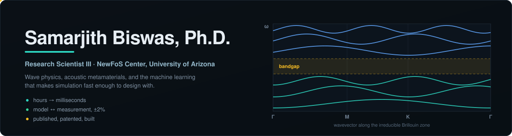
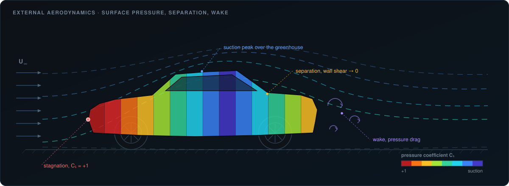
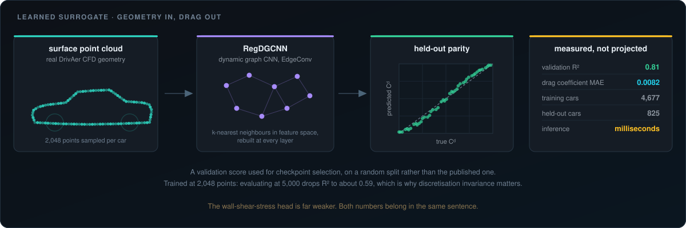

 

---

A finite-element solve of a phononic crystal takes one to three hours. I build the
surrogates that answer the same question in milliseconds, and the validation
discipline that makes the answer worth acting on.

That means owning the whole chain rather than one link in it: thousands of automated
simulations to generate training data, network architectures chosen around the
physics rather than around fashion, loss functions that penalise physically
impossible predictions, laser-vibrometer measurements on fabricated hardware, and a
comparison at the end that either agrees or gets explained. Currently that agreement
runs to within **±2%** on measured band edges.

I am equally interested in where these methods fail, because that is what decides
whether a surrogate belongs in a design loop or only in a paper.

## Selected record

| | |
|---|---|
| **Publication** | Lead author, *Scientific Reports* (2026). Directional interface modes in topological acoustic metamaterials, with A. Alù (CUNY ASRC) and M. Leamy (Georgia Tech). [10.1038/s41598-026-62783-x](https://doi.org/10.1038/s41598-026-62783-x) |
| **Publication** | Co-author, *Physical Review Applied* **25**, 054035 (2026). Composite superlattice surface-acoustic-wave RF devices. |
| **Patent** | US 2025/128,348, thermoacoustic meta-structure, in collaboration with NASA Langley. Plus one active invention disclosure as lead inventor. |
| **Facility** | Specified, built and ran a **$300K+** instrumented acoustic laboratory: anechoic and reverberation chambers, impedance tube, laser-Doppler vibrometry, modal testing. |
| **Funding** | Work supported under NSF NewFrontiers of Sound (NewFoS) award #2242925. |

## What the work looks like

Learned surrogates are only useful if you can say precisely how good they are and
where they stop being good. Two examples from current work.

External aerodynamics is a useful proving ground because the physics is unforgiving
and the ground truth is expensive. Stagnation at the nose, acceleration and suction
over the greenhouse, separation where wall shear stress reaches zero, and a wake
that sets most of the pressure drag. A surrogate has to get the field right, not
just the integrated number.

A dynamic-graph CNN reads a sampled surface point cloud and predicts a drag
coefficient. On an 825-car held-out split of real DrivAerNet CFD data it reaches
**R² 0.81** with a drag-coefficient MAE of **0.0082**, at millisecond inference.

The parts usually left out of a summary matter more than the headline. That score is
a validation number used for checkpoint selection rather than a sealed test result,
and the split is random rather than the published one. The model was trained at
2,048 sampled points, and evaluating it at 5,000 drops R² to roughly 0.59, which is a
concrete lesson in why discretisation invariance is the property to care about in
operator methods. The wall-shear-stress head is far weaker than the drag head. All of
that belongs in the same paragraph as the good number.

## Open-source engineering tools

Small, readable, and tested against physics rather than merely against execution.
Every README states the limits as plainly as the results.

| Repository | What it demonstrates |
|---|---|
| [**AcousticPINN**](https://github.com/Samarjithbiswas/AcousticPINN) | A PyTorch physics-informed network solves the wave equation with *zero* solution data at 3.9% maximum error, and recovers a hidden wave speed from 80 noisy points to **0.08%** |
| [**FEMSurrogateToolkit**](https://github.com/Samarjithbiswas/FEMSurrogateToolkit) | The full surrogate pipeline: Latin-hypercube design of experiments, POD compression, ridge regression. A 128-point spectrum in about **3 µs per design** at held-out R² ≈ 0.95 |
| [**PhononicBands**](https://github.com/Samarjithbiswas/PhononicBands) | Bloch-Floquet band structures in pure NumPy and SciPy, reproducing the steel-in-epoxy benchmark gap with physics-checked tests |
| [**SAWDeviceSim**](https://github.com/Samarjithbiswas/SAWDeviceSim) | Analytic interdigital-transducer and transfer-matrix models of SAW devices, validated to **0.3%** against a published measured device |
| [**ModalCorrelation**](https://github.com/Samarjithbiswas/ModalCorrelation) | MAC, mode pairing and COMAC: the unglamorous work that decides whether an FE model actually matches the bench |
| [**CFDSurrogate**](https://github.com/Samarjithbiswas/CFDSurrogate) | Graph neural network surrogate for airfoil flow fields, with a runnable demo |
| [**ChatCAD**](https://github.com/Samarjithbiswas/ChatCAD) | Chat-driven parametric CAD on a real OpenCascade B-rep kernel, with a multi-agent design loop and FEA on the same geometry |

## Where I am strong

**Simulation.** COMSOL Multiphysics for acoustics, solid mechanics and Bloch-Floquet
eigenvalue problems. ANSYS Mechanical and Fluent. Verification by mesh convergence
and closed-form comparison, not by inspection.

**Machine learning.** Physics-informed networks, 3D convolutional and graph
architectures, neural operators, reduced-order and POD surrogates, ONNX export to
run models in a browser. PyTorch.

**Measurement.** Anechoic and reverberation chambers, impedance tube, laser-Doppler
vibrometry, modal testing and correlation. The half of the job that decides whether
the other half was real.

**Fabrication.** Laser-machined borosilicate phononic plates, from design through to
a measured transmission spectrum.

## Currently

Physics-AI: the point where a trained model genuinely replaces a solver inside a
real engineering workflow, and the evidence required before anyone should let it.
If you work on simulation surrogates, acoustic or RF devices, or structural-dynamics
correlation, I am glad to talk.

 

*A surrogate is not a solver, a one-dimensional model is not an FE model,*
*and knowing exactly which one you are holding is most of the job.*

